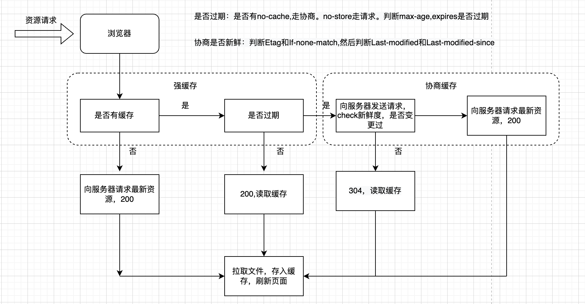

# http 缓存



### 1. 作用

针对一些诸如js,css等改动较少的文件，如果不缓存就会重新请求，会受网络因素影响，导致体验不好，给服务器也会带来压力。

### 2. 种类

强缓存和协商缓存

强缓存不发送请求到服务器，根据保质期字段max-age，Expires来判断是否缓存<br>
协商缓存会请求服务，通过服务器来判断资源是否判断是否新鲜，相关的字段是if-none-match/etag,last-modified-since/last-modified

强缓存 状态码 200
协商缓存 状态码 304

### 3. 相关响应请求头

#### 3.1 Cache-control

__响应/请求头， 缓存策略__

value:

1. no-store 不使用缓存，每次都请求服务器
2. no-cache 不走强缓存，和服务器确认新鲜度
3. max-age 单位:秒,新鲜度维持的相对时间，这段时间不会向发起请求。
4. s-max-age 单位：秒，新鲜度维持的相对时间，对代理服务器有效(cdn)
5. public 客户端和服务端都缓存
6. private 客户端缓存

#### 3.2 Expires

__响应头 资源过期时间__

value: string GMT格式，http1.0属性，在max-age共存的情况下优先级低一些

#### 3.3 Last-Modified

__响应头 资源上一次修改时间__

value: string

#### 3.4 Last-Modified-since

__请求头 浏览器记录资源最新修改时间，会和服务器Last-Modified对比__

value: string

#### 3.5 Etag

__响应头 资源标识符，资源的身份证__

value: string

#### 3.6 if-None-Match

__请求头  浏览器记录的资源上一次的身份证，用来和服务器的Etag对比__

### 4. 最佳实践

HTML：使用协商缓存  

CSS&JS:webpack打包contentHash，使用强缓存, Cache-Control: public,max-age=31536000,immutable

```js
res.writeHead(200, {
    cache-control: 'max-age:30000;public'
})
```

### 5. 其他

Service Worker, push cache（http2）
